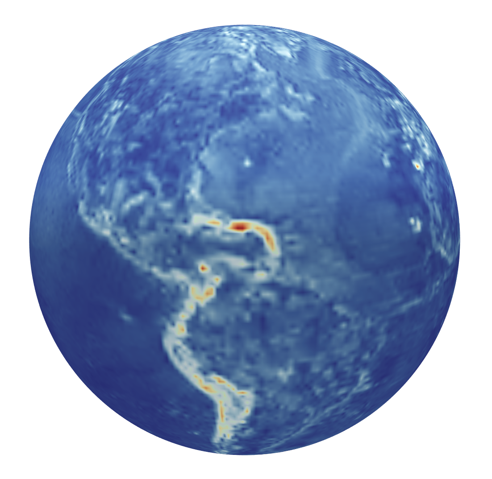

# Open Space Toolkit ▸ Physics

[](https://github.com/open-space-collective/open-space-toolkit-physics/actions/workflows/build-test.yml)
[](https://codecov.io/gh/open-space-collective/open-space-toolkit-physics)
[](https://open-space-collective.github.io/open-space-toolkit-physics)
[](https://badge.fury.io/gh/open-space-collective%2Fopen-space-toolkit-physics)
[](https://badge.fury.io/py/open-space-toolkit-physics)
[](https://opensource.org/licenses/Apache-2.0)

Physical units, time, reference frames, environment modeling.



*Gravitational field anomaly between EGM96 and WGS84 models.*

## Getting Started

Want to get started? This is the simplest and quickest way:

[](https://mybinder.org/v2/gh/open-space-collective/open-space-toolkit/main?urlpath=lab/tree/notebooks)

*Nothing to download or install! This will automatically start a [JupyterLab](https://jupyterlab.readthedocs.io/en/stable/) environment in your browser with Open Space Toolkit libraries and example notebooks ready to use.*

### Alternatives

#### Docker Images

[Docker](https://www.docker.com/) must be installed on your system.

##### iPython

The following command will start an [iPython](https://ipython.org/) shell within a container where the OSTk components are already installed:

```bash
docker run -it openspacecollective/open-space-toolkit-physics-python
```

Once the shell is up and running, playing with it is easy:

```py
from ostk.physics import Environment # Environment modeling class
from ostk.physics.time import Instant # Instant class
from ostk.physics.coordinate import Frame # Reference frame class

environment = Environment.default() # Bootstrap a default environment

moon = environment.access_object_with_name('Moon') # Access Moon

environment.set_instant(Instant.now()) # Set environment to present time

moon.get_position_in(Frame.ITRF()) # Position of the Moon in ITRF
moon.get_axes_in(Frame.ITRF()) # Axes of the Moon in ITRF
```

By default, OSTk fetches the ephemeris from JPL, Earth Orientation Parameters (EOP) and leap second count from IERS.

As a result, when running OSTk for the first time, it may take a minute to fetch all the necessary data.

*Tip: Use tab for auto-completion!*

##### JupyterLab

The following command will start a [JupyterLab](https://jupyterlab.readthedocs.io/en/stable/) server within a container where the OSTk components are already installed:

```bash
docker run --publish=8888:8888 openspacecollective/open-space-toolkit-physics-jupyter
```

Once the container is running, access [http://localhost:8888/lab](http://localhost:8888/lab) and create a Python 3 Notebook.

## Installation

### C++

The binary packages are hosted using [GitHub Releases](https://github.com/open-space-collective/open-space-toolkit-physics/releases):

- Runtime libraries: `open-space-toolkit-physics-X.Y.Z-1.x86_64-runtime`
- C++ headers: `open-space-toolkit-physics-X.Y.Z-1.x86_64-devel`
- Python bindings: `open-space-toolkit-physics-X.Y.Z-1.x86_64-python`

#### Debian / Ubuntu

After downloading the relevant `.deb` binary packages, install:

```bash
apt install open-space-toolkit-physics-*.deb
```

### Python

Install from [PyPI](https://pypi.org/project/open-space-toolkit-physics/):

```bash
pip install open-space-toolkit-physics
```

## Documentation

Documentation is available here:

- [C++](https://open-space-collective.github.io/open-space-toolkit-physics)
- [Python](./bindings/python/docs)

<details>
<summary>Structure</summary>
<p>

The library exhibits the following structure:

```txt
├── Units
│   ├── Length
│   ├── Mass
│   ├── Time
│   ├── Temperature
│   ├── Electric Current
│   ├── Luminous Intensity
│   └── Derived
│       ├── Angle
│       ├── Solid Angle
│       ├── Frequency
│       ├── Force
│       ├── Pressure
│       ├── Area
│       ├── Volume
│       └── Information
├── Time
│   ├── Scale (UTC, TT, TAI, UT1, TCG, TCB, TDB, GMST, GPST, GST, GLST, BDT, QZSST, IRNSST)
│   ├── Instant
│   ├── Duration
│   ├── Interval
│   ├── Date
│   ├── Time
│   └── DateTime
├── Coordinate
│   ├── Transform
│   └── Frame (ECI, ECEF, NED, LVLHGD, LVLHGDGT, ...)
├── Geographic
│   ├── Position
│   ├── Area
│   ├── Volume
│   ├── Coordinate Reference System (CRS)
│   └── Universal Transverse Mercator (UTM)
└── Environment
    ├── Constants
    ├── Object
    │   └── Celestial
    ├── Ephemerides
    │   ├── Analytical
    │   ├── Tabulated
    │   ├── SOFA
    │   └── SPICE (JPL)
    ├── Gravity
    │   ├── Barycentric
    │   ├── Earth Gravitational Model 1996 (EGM96)
    │   └── Earth Gravitational Model 2008 (EGM2008)
    ├── Atmospheric
    │   ├── Exponential
    │   ├── USSA1976
    │   ├── Jacchia Roberts
    │   └── NRLMSISE00
    ├── Magnetic
    │   ├── Dipole
    │   ├── World Magnetic Model 2010 (WMM2010)
    │   ├── World Magnetic Model 2015 (WMM2015)
    │   ├── Enhanced Magnetic Model 2010 (EMM2010)
    │   ├── Enhanced Magnetic Model 2015 (EMM2015)
    │   ├── International Geomagnetic Reference Field 11 (IGRF11)
    │   └── International Geomagnetic Reference Field 12 (IGRF12)
    ├── Radiation
    │   └── Sun Static
    └── Stars
        └── Hipparcos
```

</p>
</details>

## Tutorials

Tutorials are available here:

- [C++](./tutorials/cpp)
- [Python](./tutorials/python)

## Settings

The following environment variables can be set:

| Environment Variable                                                                 | Default Value                                                            |
| ------------------------------------------------------------------------------------ | ------------------------------------------------------------------------ |
| `OSTK_PHYSICS_COORDINATE_FRAME_PROVIDERS_IERS_MANAGER_MODE`                          | `Manual`                                                                 |
| `OSTK_PHYSICS_COORDINATE_FRAME_PROVIDERS_IERS_MANAGER_LOCAL_REPOSITORY`              | `./.open-space-toolkit/physics/coordinate/frame/providers/iers`          |
| `OSTK_PHYSICS_COORDINATE_FRAME_PROVIDERS_IERS_MANAGER_LOCAL_REPOSITORY_LOCK_TIMEOUT` | `60`                                                                     |
| `OSTK_PHYSICS_COORDINATE_FRAME_PROVIDERS_IERS_BULLETIN_A_MANAGER_REMOTE_URL`                    | `https://media.githubusercontent.com/media/open-space-collective/open-space-toolkit-data/main/data/coordinate/frame/providers/iers/bulletin-A/`                                       |
| `OSTK_PHYSICS_COORDINATE_FRAME_PROVIDERS_IERS_FINALS_2000_A_MANAGER_REMOTE_URL`                    | `https://media.githubusercontent.com/media/open-space-collective/open-space-toolkit-data/main/data/coordinate/frame/providers/iers/finals-2000A/`                                       |
| `OSTK_PHYSICS_COORDINATE_FRAME_PROVIDERS_IERS_MANAGER_REMOTE_URL` (shortcut to define both above)                   | `N/A`                                       |
| `OSTK_PHYSICS_ENVIRONMENT_EPHEMERIDES_SPICE_ENGINE_MODE`                             | `Manual`                                                                 |
| `OSTK_PHYSICS_ENVIRONMENT_EPHEMERIDES_SPICE_MANAGER_LOCAL_REPOSITORY`                | `./.open-space-toolkit/physics/environment/ephemerides/spice`            |
| `OSTK_PHYSICS_ENVIRONMENT_EPHEMERIDES_SPICE_MANAGER_REMOTE_URL`                      | `https://naif.jpl.nasa.gov/pub/naif/generic_kernels/`                    |
| `OSTK_PHYSICS_ENVIRONMENT_GRAVITATIONAL_EARTH_MANAGER_ENABLED`                       | `false`                                                                  |
| `OSTK_PHYSICS_ENVIRONMENT_GRAVITATIONAL_EARTH_MANAGER_LOCAL_REPOSITORY`              | `./.open-space-toolkit/physics/environment/gravitational/earth`          |
| `OSTK_PHYSICS_ENVIRONMENT_GRAVITATIONAL_EARTH_MANAGER_REMOTE_URL`                    | `https://sourceforge.net/projects/geographiclib/files/gravity-distrib/`  |
| `OSTK_PHYSICS_ENVIRONMENT_MAGNETIC_EARTH_MANAGER_ENABLED`                            | `false`                                                                  |
| `OSTK_PHYSICS_ENVIRONMENT_MAGNETIC_EARTH_MANAGER_LOCAL_REPOSITORY`                   | `./.open-space-toolkit/physics/environment/magnetic/earth`               |
| `OSTK_PHYSICS_ENVIRONMENT_MAGNETIC_EARTH_MANAGER_REMOTE_URL`                         | `https://sourceforge.net/projects/geographiclib/files/magnetic-distrib/` |
| `OSTK_PHYSICS_ENVIRONMENT_ATMOSPHERIC_EARTH_MANAGER_MODE`                            | `Automatic`                                                              |
| `OSTK_PHYSICS_ENVIRONMENT_ATMOSPHERIC_EARTH_MANAGER_LOCAL_REPOSITORY`                | `./.open-space-toolkit/physics/environment/atmospheric/earth`               |
| `OSTK_PHYSICS_ENVIRONMENT_ATMOSPHERIC_EARTH_MANAGER_REMOTE_URL`                      | `http://celestrak.org/SpaceData/` |

## Setup

### Development Environment

Using [Docker](https://www.docker.com) for development is recommended, to simplify the installation of the necessary build tools and dependencies.
Instructions on how to install Docker are available [here](https://docs.docker.com/install/).

To start the development environment:

```bash
make start-development
```

This will:

1. Build the `openspacecollective/open-space-toolkit-physics-development` Docker image.
2. Create a development environment container with local source files and helper scripts mounted.
3. Start a `bash` shell from the `./build` working directory.

If installing Docker is not an option, you can manually install the development tools (GCC, CMake) and all required dependencies,
by following a procedure similar to the one described in the [Development Dockerfile](./docker/development/Dockerfile).

### Build

From the `./build` directory:

```bash
cmake ..
make
```

*Tip: The `ostk-build` command simplifies building from within the development environment.*

### Test

To start a container to build and run the tests:

```bash
make test
```

Or to run them manually:

```bash
./bin/open-space-toolkit-physics.test
```

*Tip: The `ostk-test` command simplifies running tests from within the development environment.*

## Dependencies

| Name          | Version      | License                                                    | Link                                                                                                                                       |
| ------------- | ------------ | ---------------------------------------------------------- | ------------------------------------------------------------------------------------------------------------------------------------------ |
| Pybind11      | `2.10.1`     | BSD-3-Clause                                               | [github.com/pybind/pybind11](https://github.com/pybind/pybind11)                                                                           |
| {fmt}         | `5.2.0`      | BSD-2-Clause                                               | [github.com/fmtlib/fmt](https://github.com/fmtlib/fmt)                                                                                     |
| ordered-map   | `0.6.0`      | MIT                                                        | [github.com/Tessil/ordered-map](https://github.com/Tessil/ordered-map)                                                                     |
| Eigen         | `3.3.7`      | MPL2                                                       | [eigen.tuxfamily.org](http://eigen.tuxfamily.org/index.php)                                                                                |
| IAU SOFA      | `2018-01-30` | [SOFA Software License](http://www.iausofa.org/tandc.html) | [www.iausofa.org](http://www.iausofa.org)                                                                                                  |
| SPICE Toolkit | `N0067`      | [NAIF](https://naif.jpl.nasa.gov/naif/rules.html)          | [naif.jpl.nasa.gov/naif/toolkit.html](https://naif.jpl.nasa.gov/naif/toolkit.html)                                                         |
| GeographicLib | `1.52`       | MIT                                                        | [geographiclib.sourceforge.io](https://geographiclib.sourceforge.io)                                                                       |
| Core          | `main`       | Apache License 2.0                                        | [github.com/open-space-collective/open-space-toolkit-core](https://github.com/open-space-collective/open-space-toolkit-core)               |
| I/O           | `main`       | Apache License 2.0                                        | [github.com/open-space-collective/open-space-toolkit-io](https://github.com/open-space-collective/open-space-toolkit-io)                   |
| Mathematics   | `main`       | Apache License 2.0                                        | [github.com/open-space-collective/open-space-toolkit-mathematics](https://github.com/open-space-collective/open-space-toolkit-mathematics) |

## Contribution

Contributions are more than welcome!

Please read our [contributing guide](CONTRIBUTING.md) to learn about our development process, how to propose fixes and improvements, and how to build and test the code.

## Special Thanks

[](https://www.loftorbital.com/)

## License

Apache License 2.0
